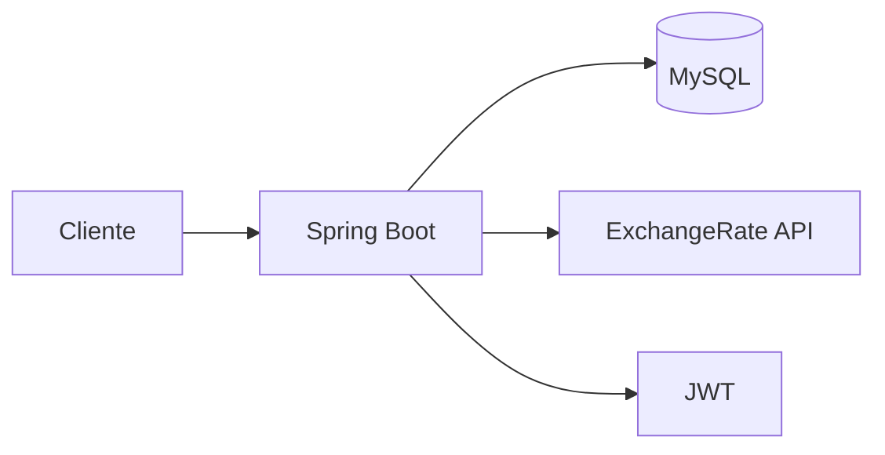

# Coin Converter


API RESTful para conversão de moedas fiduciárias em tempo real. Qualquer pessoa pode realizar conversões e visualizar estatísticas globais da plataforma. Usuários com conta têm acesso a funcionalidades extras, como histórico pessoal e conversões favoritas.

---

## Sobre o Projeto

O Coin Converter foi desenvolvido durante as férias como um projeto de aprendizado, com o objetivo de colocar em prática vários conceitos ao mesmo tempo em algo concreto e funcional. A ideia central é simples: você informa a moeda de origem, a moeda de destino e o valor — a API consulta as taxas em tempo real e retorna o resultado.

Do ponto de vista técnico, o projeto serviu para aprofundar o uso do **Spring Boot** e Java, explorando desde a construção dos endpoints REST com Spring Web MVC até o controle de autenticação com Spring Security. A integração com uma **API externa** (ExchangeRate-API) foi uma parte importante do processo, lidando com requisições HTTP, tratamento de resposta e uso de chaves de acesso via variáveis de ambiente. No lado do banco de dados, o projeto utiliza **MySQL gerenciado via Docker**, com persistência feita através do Spring Data JPA — o que envolveu entender o mapeamento de entidades, repositórios e a comunicação entre a aplicação e o banco. Toda a infraestrutura roda com **Docker e Docker Compose**, eliminando a necessidade de configurar qualquer dependência manualmente na máquina.

Usuários não autenticados conseguem realizar conversões normalmente e ver as estatísticas gerais de uso da API. Quem cria uma conta ganha acesso a:

- Histórico das próprias conversões
- Favoritos para acessar conversões frequentes mais rapidamente
- Estatísticas individuais da conta

---

## Arquitetura



As taxas de câmbio vêm da [ExchangeRate-API](https://v6.exchangerate-api.com), consultada em tempo real a cada conversão. Os dados dos usuários e conversões são persistidos no MySQL, que roda em container Docker junto com a aplicação.

Embora a aplicação não tenha como objetivo ser colocada em produção, a API gratuita possui um limite mensal de 1500 requisições, o que motivou a implementação de uma estratégia para otimizar seu uso. Para isso, foi desenvolvido um sistema de cache que armazena as taxas de conversão por aproximadamente 30 minutos. Dessa forma, quando um usuário solicita uma conversão que já foi realizada recentemente por outro usuário e a taxa ainda está dentro do período de validade, o sistema utiliza o cache em vez de realizar uma nova chamada à API externa, reduzindo significativamente o consumo do limite mensal.

---

## Moedas Suportadas

A API trabalha exclusivamente com **moedas fiduciárias**, seguindo o padrão ISO 4217 (códigos de três letras). São 165 moedas ao total, cobrindo os principais países e regiões do mundo. Alguns exemplos:

| Código | Moeda | País/Região |
|--------|-------|-------------|
| BRL | Real Brasileiro | Brasil |
| USD | Dólar Americano | Estados Unidos |
| EUR | Euro | União Europeia |
| GBP | Libra Esterlina | Reino Unido |
| JPY | Iene Japonês | Japão |
| ARS | Peso Argentino | Argentina |
| CAD | Dólar Canadense | Canadá |
| CHF | Franco Suíço | Suíça |
| CNY | Yuan Chinês | China |
| AUD | Dólar Australiano | Austrália |

A lista completa está disponível na documentação da ExchangeRate-API: https://www.exchangerate-api.com/docs/supported-currencies

> Criptomoedas (BTC, ETH, etc.) não são suportadas nesta versão. O suporte a ativos digitais está planejado para versões futuras.

---

## Tech Stack

| Tecnologia | Versão | Função |
|---|---|---|
| Java | 21 | Linguagem principal |
| Spring Boot | 4.0.1 | Framework backend |
| Spring Web MVC | — | Camada HTTP e endpoints REST |
| Spring Security | — | Controle de autenticação e acesso |
| Spring Data JPA | — | Acesso e persistência no banco de dados |
| Auth0 java-jwt | 4.4.0 | Tokens JWT para autenticação |
| MySQL | latest | Banco de dados relacional |
| Lombok | — | Redução de código repetitivo |
| Springdoc OpenAPI | 3.0.1 | Documentação automática via Swagger |
| Docker + Compose | — | Containerização e orquestração |
| Maven | — | Build e gerenciamento de dependências |

---

## Estrutura do Projeto

```
Coin-Converter/
│
├── src/
│   └── main/
│       ├── java/com/coinconverter/
│       └── resources/
│           └── application.properties
│
├── target/                  # Gerado após o build com Maven
├── Dockerfile
├── docker-compose.yml
├── pom.xml
├── .env                     # Variáveis de ambiente (não versionar)
└── README.md
```

---

## Containers

**database**
- Imagem: `mysql:latest`
- Porta: `3307` (host) → `3306` (container)
- Volume persistente: `mysql_data`

**app**
- Imagem base: `eclipse-temurin:21-jre`
- Porta: `8080`
- Depende do container `database`

---

## Variáveis de Ambiente

Crie um arquivo `.env` na raiz do projeto:

```env
MYSQL_ROOT_PASSWORD=yourpassword
MYSQL_DATABASE=coinconverter
MYSQL_USER=user
MYSQL_PASSWORD=password
API_KEY=sua_chave_da_exchangerate_api
JWT_SECRET=seu_segredo_jwt
```

Para obter uma chave da API de câmbio, crie uma conta gratuita em: https://www.exchangerate-api.com

---

## Como Rodar

### Pré-requisitos

- Docker
- Docker Compose
- Maven (apenas para o build inicial)

Não é necessário instalar Java ou MySQL localmente.

---

### Por que preciso do Maven antes do Docker?

O Dockerfile copia o `.jar` compilado da pasta `target/`:

```dockerfile
COPY target/*.jar app.jar
```

Por isso é preciso compilar o projeto com Maven primeiro — caso contrário, o Docker não encontra o arquivo e falha no build. Esse passo só é necessário uma vez ou quando o código for alterado.

---

### Passo a passo

**1. Clone o repositório**

```bash
git clone https://github.com/JeannVictor/Coin-Converter.git
cd Coin-Converter
```

**2. Compile o projeto**

```bash
mvn clean package -DskipTests
```

**3. Crie o arquivo `.env`** com as variáveis descritas acima.

**4. Suba os containers**

```bash
docker compose up --build
```

A aplicação estará disponível em `http://localhost:8080`.  
O banco de dados estará acessível em `localhost:3307`.

**Para parar:**

```bash
docker compose down
```

**Para parar e remover os dados do banco:**

```bash
docker compose down -v
```

---

## Documentação da API

Com a aplicação rodando, acesse o Swagger em:

```
http://localhost:8080/swagger-ui/index.html
```

---

## Atualizações Futuras

- Suporte a criptomoedas (BTC, ETH, entre outras)
- Interface web (frontend)

---

## Licença

Distribuído sob a licença MIT. Consulte o arquivo `LICENSE` para mais informações.

---

## Autor

Jeann Victor — [github.com/JeannVictor](https://github.com/JeannVictor)